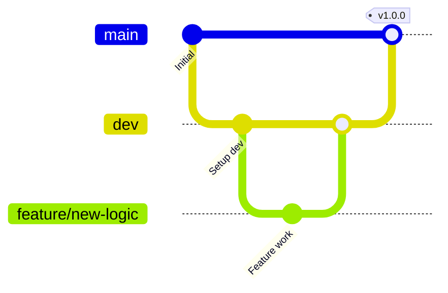

# Contributing to HSK Mock Test

Thank you for your interest in contributing! This project follows a structured development workflow to ensure code quality and stability.

## Development Workflow

We use a feature-branching model:

1.  **main**: The production-ready branch. Only stable code is merged here.
2.  **dev**: The integration branch. Features are merged here first for testing.
3.  **feature/***: Branches for specific features, bug fixes, or improvements.

### Step-by-Step Instructions

1.  **Branch from dev**: Create a new branch for your work.
    ```bash
    git checkout dev
    git pull origin dev
    git checkout -b feature/your-feature-name
    ```

2.  **Install dependencies**:
    ```bash
    make install
    ```
    This will install project dependencies via Poetry and set up pre-commit hooks.

3.  **Develop and test**:
    Make your changes and ensure tests pass:
    ```bash
    make check
    ```
    This runs linting (Ruff), type checking (MyPy), and unit tests (Pytest).

4.  **Commit your changes**:
    Pre-commit hooks will run automatically. If they fail, fix the issues and try again.

5.  **Submit a Pull Request**:
    Target the `dev` branch for your PR. Once approved and merged into `dev`, it will eventually be merged into `main`.

## Coding Standards

- **Linting**: We use [Ruff](https://github.com/astral-sh/ruff) for linting and formatting.
- **Type Checking**: We use [MyPy](https://github.com/python/mypy) for static type analysis.
- **Testing**: We use [Pytest](https://docs.pytest.org/) for unit tests.

## Branching Strategy Recap


